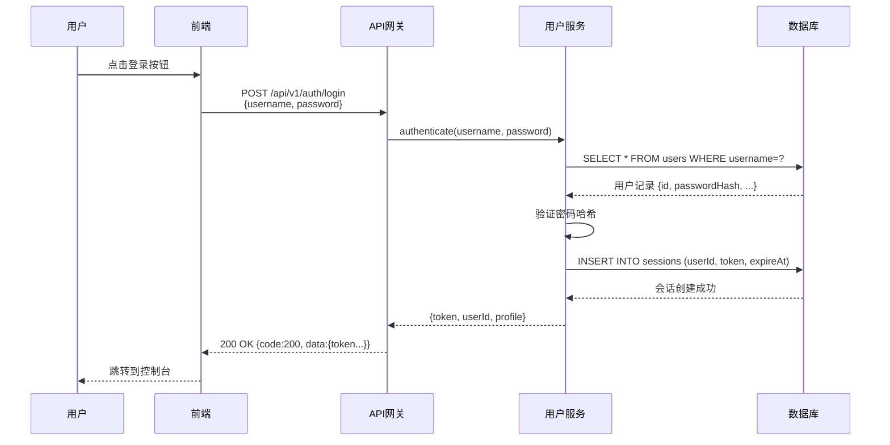

# 代码库核心业务分析

对代码库进行深度分析，重点关注**核心业务流程**、**前后端接口交互**和**实现细节**。
**严禁输出大而全的代码库分析文档！** 比如项目架构，技术框架，编译配置，目录结构，项目特点，开发指南这些统统都不需要。只需要关注核心业务相关的内容！

分析目标：当前工作区中的代码库

## 分析优先级

### 1. API接口分析（最高优先级）

当发现API端点或接口定义时，必须详细记录：

#### API端点基本信息
- **接口路径**：完整的URL路径（如 `/api/v1/users/login`）
- **请求方法**：GET/POST/PUT/DELETE/PATCH
- **业务用途**：此接口服务的业务功能，要求详细描述相关的业务逻辑。不能仅仅只是概述
- **前端调用位置**：[文件名.ts:行号](路径#L行号)
- **后端处理位置**：[文件名.cpp:行号](路径#L行号)

#### 请求数据格式（必须精确）
记录每个字段的完整信息：比如
```
字段名     | 类型    | 必填 | 说明           | 示例值    | 验证规则
-----------|---------|------|----------------|-----------|------------------
username   | string  | 是   | 用户登录名     | "admin"   | 4-20个字符，仅字母数字
password   | string  | 是   | 用户密码       | "pass123" | 6-32个字符，MD5加密
rememberMe | boolean | 否   | 是否保持会话   | true      | 默认值：false
```

#### 响应数据格式（必须精确）
记录完整的响应结构，包括嵌套对象：比如
```json
{
  "code": 200,           // 响应状态码
  "message": "成功",     // 提示信息
  "data": {
    "userId": 12345,     // 用户唯一标识符（int64类型）
    "token": "eyJ...",   // JWT认证令牌（string类型，256字符）
    "expireAt": 1234567890, // 令牌过期时间戳（unix时间戳）
    "profile": {
      "name": "张三",    // 用户显示名称（string，最大50字符）
      "email": "a@b.com" // 用户邮箱（string，有效邮箱格式）
    }
  }
}
```

#### 请求/响应示例
提供完整的可运行示例：
- 完整的请求（包含请求头）
- 成功响应示例（200）
- 错误响应示例（400、401、403、404、500）及实际错误信息

**关键点：**

- 如果响应数据中包含了新的API接口，那么也需要进行详细分析
- 详细说明响应数据每一个字段相关的业务逻辑，避免用户只能看到接口数据格式而不知道具体业务逻辑

### 2. C++类实现分析

对每个核心C++类，提供以下信息：

#### 类概览
- **完整类名**：包含命名空间（如 `MyApp::Services::UserManager`）
- **头文件位置**：[UserManager.h](include/UserManager.h)
- **实现文件位置**：[UserManager.cpp](src/UserManager.cpp)
- **继承关系**：父类和子类关系及层次结构图
- **核心职责**：用一句话说明该类的主要职责

#### 成员变量（记录重要的变量）
```cpp
class UserManager {
private:
    int m_userId;              // 当前登录用户ID（0表示未登录）
    std::string m_sessionToken; // JWT会话令牌，用于API认证
    DatabasePool* m_dbPool;    // 数据库连接池指针（非拥有关系）
    std::map<int, User> m_cache; // 用户对象缓存，key=userId，登出时清空
};
```

#### 成员函数（详细说明关键方法）

对每个重要方法，记录：

**函数签名**：

```cpp
bool UserManager::authenticateUser(
    const std::string& username,  // 用户登录名，4-20个字符
    const std::string& password,  // 明文密码，内部会进行哈希处理
    bool rememberMe = false       // 可选：是否创建长期会话
)
```

**功能说明**：从业务角度说明此函数的作用

**参数说明**：每个参数的类型、约束条件和用途

**返回值说明**：
- `true`/`false` 分别表示什么，或
- 返回对象包含什么内容，或
- 可能的返回码及其含义


**线程安全性**：此方法是否线程安全？是否使用了锁？

**性能注意事项**：是否有缓存？数据库查询？IO操作？

### 3. 客户端提供的 JS Basic 接口分析

客户端通过 WebViewWrap::IWebViewEx 接口的 RegisterFunction 成员函数注册C++客户端接口以便前端调用。

如果有，那么需要详细说明注册的接口的详细信息，包括接口参数，返回值，调用场景，主要功能。

如果没有，那么就说明无 JS Basic 接口交互。

**注意：必须详细列出所有注册的JS Basic 接口！不能漏掉，因为这是前端/客户端交互的至关重要的一部分！**

### 4. 业务流程分析

追踪从前端到后端到数据库的完整数据流：比如



### 5. 关键业务逻辑

识别并解释：
- **关键决策点**：业务规则在哪里应用
- **状态转换**：对象如何在不同状态间转换
- **数据转换**：数据格式在哪里/如何变化
- **验证逻辑**：每一层发生了什么验证
- **错误处理策略**：错误如何传播和处理

### 6. 打点/统计上报分析

识别每一个打点上报的内容，并记录：

- **打点的模块：**说明每一个打点上报是由哪一个进程模块所发起的网络请求
- **打点的类型(Type)：**说明每一个打点所属的业务类型
- **打点的Action：**说明每一个action代表的含义以及业务逻辑
- **打点的额外参数字段：**说明打点上报的额外参数字段的含义
- **所有打点的业务流程图：**使用Mermaid流程图详细展示打点的顺序路径，以及路径上所依赖的条件等等，要求尽量详细！

**注意：打点上报是用于数据回收统计的重要关键点！必须做到完整记录每一个打点信息！**

## 输出格式
将分析结构化为：

### 1. 执行摘要
- 主要业务功能是什么？
- 涉及哪些关键组件？

### 2. API接口文档
对发现的每个API端点：
- 完整文档，包含请求/响应格式
- 数据类型规范
- 请求和响应示例
- 错误场景

### 3. C++类文档
对每个核心类：
- 类的用途和职责
- 关键成员变量及其用途
- 重要方法的详细说明
- 使用示例

### 4. JS Basic 接口文档

对每一个JS Basic 接口：

- 完整文档，包含详细的参数/返回值格式
- 数据类型说明
- 涉及到的关键的业务逻辑说明
- 使用示例

### 5. 业务流程图
- 显示完整流程的序列图
- 状态转换图（如适用）

### 6. 数据流分析
- 关键数据如何在系统中流转
- 关键数据在哪里被验证
- 关键数据在哪里被转换

### 7. 打点/统计上报分析

- 打点/统计的模块，类型，Action，额外参数字段明细
- 显示完整的打点业务流程图，在这个流程中，需要明确将打点action用*号标记出来，方便查看

### 8. 关键发现
- 安全问题
- 性能瓶颈
- 代码质量问题
- 缺失的错误处理

### 9. 版本迭代记录

- 版本迭代的需求文档：[XXX 第 X 期 需求文档](../prd/xxx.prd.md)
- 迭代的主要内容

## 重要规则

1. **文档生成的位置在当前工作区的doc目录下，文档名为：codebase-core-workflow.md**
2. **如果当前工作区的doc目录下已经存在了codebase-core-workflow.md，那么就根据最新的代码更新文档，而不是从0开始重新编写文档**
3. **生成的文档必须用中文，并且是UTF-8编码的，使用 markdown 格式**
4. **始终使用可点击的引用**：[文件名.cpp:42](src/文件名.cpp#L42)
5. **数据类型必须精确**：不要只说"string"，要说"string（最大255字符，UTF-8编码）"
6. **记录所有字段**：请求/响应文档中绝不遗漏任何字段
7. **展示真实示例**：使用代码中的实际值或真实的示例
8. **追踪完整流程**：从开始到结束跟踪代码执行
9. **打点上报的数据统计分析一定要完整**
10. **注明安全影响**：认证、授权、输入验证
11. **忽略样板代码**：专注业务逻辑，除非关键否则不关注日志/工具函数

## 分析步骤

1. **识别入口点**：API端点、主函数、事件处理器
2. **追踪数据流**：跟随数据从输入到输出
3. **记录接口**：精确捕获所有API契约
4. **分析类**：理解类的职责和交互
5. **映射业务逻辑**：识别业务规则在哪里实现
6. **打点/统计上报分析：**识别并详细说明打点流程和打点信息
7. **创建图表**：用mermaid图表可视化流程
8. **提供示例**：展示如何使用API/类

重点在于**理解和记录**业务逻辑，而不是批评代码风格。

