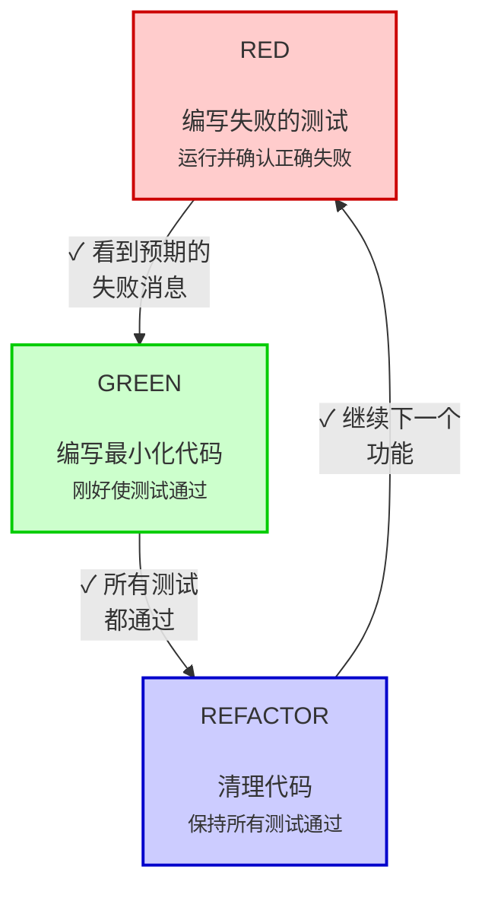
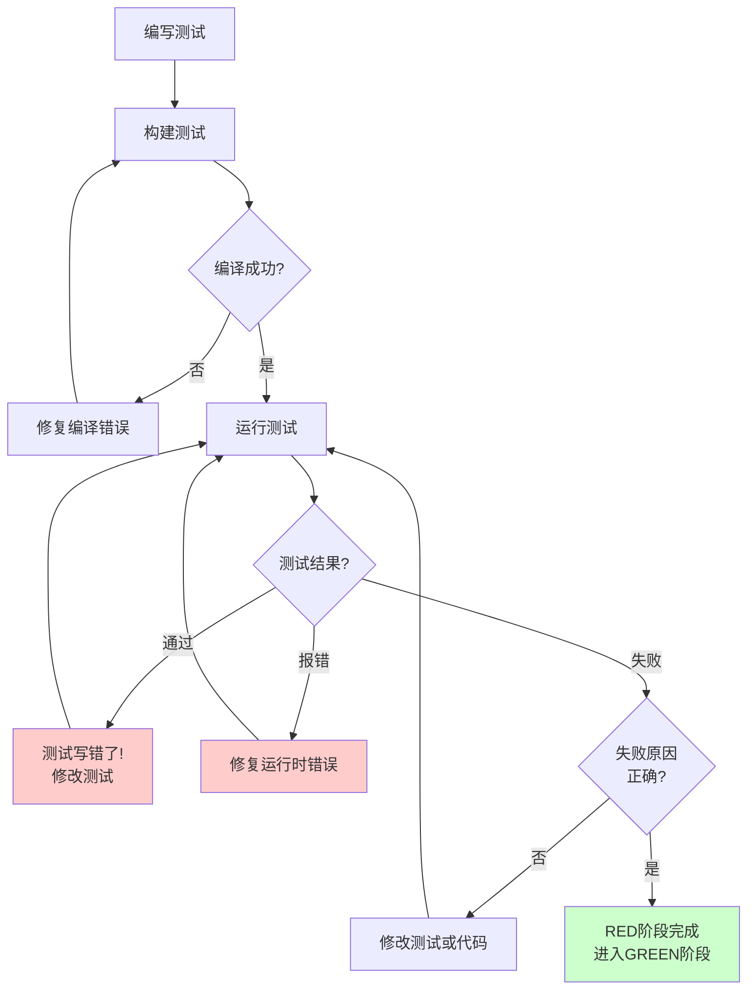

# 测试驱动开发(TDD)

## 概述

先写测试。观察它失败。编写最少的代码使其通过。

**核心原则：** 如果你没有看到测试失败，你就不知道它是否测试了正确的东西。

**严禁先写代码再补测试。遵循步骤才能获得TDD的价值：**

1. 后写的测试会立即通过 → 无法验证测试本身是否正确
2. 根据实现写测试 → 测试的是"代码做了什么"，而非"代码应该做什么"
3. 依赖记忆补测试 → 会遗漏未曾考虑的边缘情况
4. 跳过红绿循环 → 失去测试驱动设计的反馈

本文档使用 **C++ + Google Test** 作为示例语言和测试框架。

## 何时使用

**总是使用：**
- 新功能
- Bug修复
- 重构
- 行为变更

**有限例外（需获得明确批准）：**

- 一次性原型（探索后即删除）
- 代码生成工具的输出
- 纯配置文件（JSON/YAML等）

**警告：** 严禁任何"这次跳过TDD"的想法。

## 铁律

```
没有先编写失败的测试，就不许编写生产代码
```

**一旦发现违反顺序（先写了代码）：**

1. 立即删除该代码
2. 从编写失败的测试开始重写

**唯一正确的做法：** 先写测试，看它失败，再实现代码。

## Red-Green-Refactor循环



### RED - 编写失败的测试

编写一个最小的测试来展示应该发生什么。

<Good>
```cpp
// retry_operation_test.cpp
#include <gtest/gtest.h>
#include <functional>
#include <stdexcept>
#include "retry_operation.h"

TEST(RetryOperationTest, RetriesFailedOperations3Times) {
  int attempts = 0;
  auto operation = [&attempts]() -> std::string {
    attempts++;
    if (attempts < 3) {
      throw std::runtime_error("fail");
    }
    return "success";
  };
  // 注：此时 retryOperation() 是一个空的实现，运行测试会失败，然后进入 GREEN 阶段 实现最小化代码！
  std::string result = retryOperation(operation);

  EXPECT_EQ(result, "success");
  EXPECT_EQ(attempts, 3);
}
```
清晰的名称，测试真实行为，单一职责
</Good>

<Bad>
```cpp
// retry_operation_test.cpp (不推荐的写法)
#include <gtest/gtest.h>
#include <gmock/gmock.h>

TEST(RetryOperationTest, RetryWorks) {
  MockFunction<std::string()> mockOperation;
  EXPECT_CALL(mockOperation, Call())
      .WillOnce(Throw(std::runtime_error("fail")))
      .WillOnce(Throw(std::runtime_error("fail")))
      .WillOnce(Return("success"));

  retryOperation(mockOperation.AsStdFunction());
  // 只验证调用次数，没有验证实际结果
}
```
模糊的名称，测试的是mock而不是代码
</Bad>

**要求：**
- 单一行为
- 清晰的名称
- 真实代码（除非不可避免，否则不使用mock）

### 验证RED - 观察它失败

**强制要求。绝不跳过。**

```bash
./build/tests/retry_operation_test
# 或使用 ctest
ctest -R RetryOperationTest
```

确认：
- 测试失败（而不是因为编译，环境等发生的错误导致的失败）
- 失败消息符合预期
- 因为功能缺失而失败（不是拼写错误）

**测试通过？** 你在测试已存在的行为。修复测试。
**测试报错？** 修复错误，重新运行直到它**正确失败**。

### 完整的 RED 阶段流程
要严格遵守以下完整的 RED 阶段流程:


### GREEN - 最小化代码

编写最简单的代码来通过测试。

<Good>
```cpp
// retry_operation.h
#pragma once
#include <functional>
#include <stdexcept>

template<typename T>
T retryOperation(std::function<T()> fn) {
  for (int i = 0; i < 3; i++) {
    try {
      return fn();
    } catch (const std::exception& e) {
      if (i == 2) throw;
    }
  }
  throw std::runtime_error("unreachable");
}
```
刚好够用以通过测试
</Good>

<Bad>
```cpp
// retry_operation.h (过度设计的版本)
#pragma once
#include <functional>
#include <chrono>

enum class BackoffStrategy { Linear, Exponential };

struct RetryOptions {
  int maxRetries = 3;
  BackoffStrategy backoff = BackoffStrategy::Exponential;
  std::function<void(int)> onRetry = nullptr;
  std::chrono::milliseconds delayMs{100};
};

template<typename T>
T retryOperation(
  std::function<T()> fn,
  const RetryOptions& options = RetryOptions{}
) {
  // YAGNI - 你不需要它
  // 过早添加了配置选项、回退策略、回调等功能
}
```
过度设计
</Bad>

不要添加功能、重构其他代码或超出测试范围"改进"代码。

### 验证GREEN - 观察它通过

**强制要求。**

```bash
./build/tests/retry_operation_test
# 或运行所有测试
ctest
```

确认：
- 测试通过
- 其他测试仍然通过
- 输出干净（没有错误、警告）

**测试失败？** 修复功能代码，而不是测试代码。

**其他测试失败？** 立即修复。

### REFACTOR - 清理代码

仅在绿色状态后：
- 消除重复
- 改进命名
- 提取辅助函数
- 增强代码可读性

保持测试绿色。不要添加行为。

### 重复

为下一个功能编写下一个正确失败的测试。

## 好的测试

### 测试质量标准

#### 1. **最小化** - 一个测试只测一件事

<Good>
```cpp
// 好 - 每个测试只验证一个行为
TEST(EmailValidatorTest, RejectsEmptyEmail) {
  EXPECT_FALSE(validateEmail(""));
}

TEST(EmailValidatorTest, RejectsMissingAtSymbol) {
  EXPECT_FALSE(validateEmail("userexample.com"));
}

TEST(EmailValidatorTest, RejectsMissingDomain) {
  EXPECT_FALSE(validateEmail("user@"));
}
```
每个测试专注于一个失败场景，失败时容易定位问题
</Good>

<Bad>
```cpp
// 坏 - 一个测试验证多个行为
TEST(EmailValidatorTest, ValidatesEmailAndDomainAndWhitespace) {
  EXPECT_FALSE(validateEmail(""));           // 空邮箱
  EXPECT_FALSE(validateEmail("user@"));      // 缺少域名
  EXPECT_FALSE(validateEmail(" user@a.com ")); // 有空格
}
```
测试失败时无法快速判断是哪个场景出错了
</Bad>

**判断标准：** 测试名称中有"和"（And）或"及"？考虑拆分成多个测试。

---

#### 2. **清晰** - 名称清楚描述测试的行为

<Good>
```cpp
// 好 - 从名称就能看出测试什么
TEST(UserServiceTest, CreatesUserWithValidEmail)
TEST(UserServiceTest, RejectsUserWithDuplicateEmail)
TEST(AuthServiceTest, LocksAccountAfter5FailedAttempts)
```
不用看代码就知道测试的具体行为
</Good>

<Bad>

```cpp
// 坏 - 名称模糊，无法理解测试内容
TEST(MyTest, Test1)
TEST(UserServiceTest, TestUser)
TEST(AuthServiceTest, Works)
```
必须阅读代码才能理解测试目的
</Bad>

**命名公式：** `动词 + 具体场景 + 预期结果`

- `RejectsEmptyEmail` = Rejects（动词）+ EmptyEmail（场景）
- `LocksAccountAfter5FailedAttempts` = Locks（动词）+ AccountAfter5FailedAttempts（场景）

---

#### 3. **展示意图** - 测试作为代码使用示例

<Good>
```cpp
// 好 - 展示如何使用 API
TEST(FileReaderTest, ReadsFileContents) {
  FileReader reader("data.txt");

  std::string content = reader.read();

  EXPECT_EQ(content, "expected content");
}
```
测试清楚展示了：如何创建对象、如何调用方法、期望什么结果
</Good>

<Bad>
```cpp
// 坏 - 隐藏实现细节，难以理解
TEST(FileReaderTest, Test) {
  auto r = createTestReader();  // 不知道怎么创建
  auto result = processData(r); // 不知道做了什么
  EXPECT_TRUE(checkResult(result)); // 不知道验证什么
}
```
过度抽象，看不出实际的使用方式
</Bad>

**原则：** 测试应该像文档一样，展示最简单直接的使用方式

## C++ 测试最佳实践

### RAII 和资源管理

```cpp
// Good - 使用 RAII 自动清理
TEST(FileTest, WritesDataCorrectly) {
  {
    File file("test.txt");  // 构造函数打开文件
    file.write("data");
  } // 析构函数自动关闭文件

  File file("test.txt");
  EXPECT_EQ(file.read(), "data");
}

// Bad - 手动管理，可能泄漏
TEST(FileTest, WritesDataCorrectly) {
  File* file = new File("test.txt");
  file->write("data");
  // 忘记 delete！测试失败会导致内存泄漏
}
```

### 使用 Test Fixtures 管理共享设置

```cpp
class DatabaseTest : public ::testing::Test {
protected:
  void SetUp() override {
    // 每个测试前执行
    db = std::make_unique<Database>(":memory:");
    db->initialize();
  }

  void TearDown() override {
    // 每个测试后执行（通常不需要，RAII 会处理）
  }

  std::unique_ptr<Database> db;
};

TEST_F(DatabaseTest, InsertsUserCorrectly) {
  User user{1, "John"};
  db->insert(user);
  EXPECT_EQ(db->getUser(1).name, "John");
}
```

### 断言选择

```cpp
// 使用正确的断言宏
EXPECT_EQ(actual, expected);      // 相等
EXPECT_NE(actual, expected);      // 不相等
EXPECT_LT(actual, expected);      // 小于
EXPECT_TRUE(condition);           // 布尔值
EXPECT_THROW(expr, ExcType);      // 抛出特定异常
EXPECT_NO_THROW(expr);            // 不抛出异常

// EXPECT vs ASSERT
EXPECT_EQ(x, y);  // 失败后继续执行
ASSERT_EQ(x, y);  // 失败后立即停止（用于致命错误）
```

### Mock 外部依赖

```cpp
// 定义接口
class IDatabase {
public:
  virtual ~IDatabase() = default;
  virtual User getUser(int id) = 0;
  virtual void saveUser(const User& user) = 0;
};

// Mock 实现
class MockDatabase : public IDatabase {
public:
  MOCK_METHOD(User, getUser, (int id), (override));
  MOCK_METHOD(void, saveUser, (const User& user), (override));
};

// 测试中使用
TEST(UserServiceTest, FetchesUserFromDatabase) {
  // 1. 创建 Mock 对象
  MockDatabase mockDb;
  // 2. 设置期望：当调用 getUser(1) 时，返回指定的 User 对象
  EXPECT_CALL(mockDb, getUser(1))
      .WillOnce(Return(User{1, "John"}));
	// 3. 将 Mock 注入到被测试的服务中 (依赖注入)
  UserService service(&mockDb);
  // 4. 执行被测代码
  User user = service.getUser(1);
  // 5. 验证结果
  EXPECT_EQ(user.name, "John");
}
```

## 为什么顺序很重要 - TDD的核心理念

#### 不要编写功能代码之后再编写测试来验证它工作

测试优先强制你看到测试失败，证明它确实测试了某些东西。

#### 不要手动测试

自动化测试是系统化的。它们每次都以相同的方式运行。

#### 不要以为删除没有经过测试的代码是一种时间浪费

没有真实测试的工作代码是技术债务，在将来可能会浪费更多的时间去解决。

#### 不要以为TDD是教条主义

TDD是务实的：
- 在提交前发现bug（比提交后调试更快）
- 防止回归（测试立即捕获破坏）
- 记录行为（测试展示如何使用代码）
- 支持重构（自由改变，测试捕获破坏）

#### 不要让测试滞后，测试应该先于功能实现

滞后的测试回答"这做了什么?"，前置的测试回答"这应该做什么?"

滞后的测试被你的实现所偏向。你测试你构建的东西，而不是需要的东西。你验证记住的边缘情况，而不是发现的边缘情况。

前置的测试在实现前强制发现边缘情况。

## 常见的自我合理化

| 借口 | 现实 |
|------|------|
| "太简单了不需要测试" | 简单的代码也会坏。测试只需30秒。 |
| "我会事后测试" | 立即通过的测试什么都证明不了。 |
| "测试事后能达到同样的目标" | 测试事后 = "这做了什么？"测试优先 = "这应该做什么？" |
| "已经手动测试过了" | 临时 ≠ 系统化。没有记录，无法重新运行。 |
| "删除X小时是浪费" | 沉没成本谬论。保留未验证的代码是技术债务。 |
| "保留作为参考，先写测试" | 你会调整它。那就是测试事后。删除就是删除。 |
| "需要先探索" | 可以。扔掉探索，用TDD开始。 |
| "测试难 = 设计不清晰" | 听从测试。难以测试 = 难以使用。 |
| "TDD会拖慢我" | TDD比调试快。务实 = 测试优先。 |
| "手动测试更快" | 手动不能证明边缘情况。每次改变都要重新测试。 |
| "现有代码没有测试" | 你在改进它。为现有代码添加测试。 |

## 危险信号 - 停止并重新开始

- 代码在测试之前
- 实现后才测试
- 测试立即通过
- 无法解释为什么测试失败
- 测试"稍后"添加
- 自我合理化"就这一次"
- "我已经手动测试过了"
- "测试事后能达到同样的目的"
- "这是关于精神而不是仪式"
- "保留作为参考"或"调整现有代码"
- "已经花了X小时，删除是浪费"
- "TDD是教条主义，我在务实"
- "这是不同的因为..."

**所有这些都意味着：删除代码。用TDD重新开始。**

## 示例：Bug修复

**Bug：** 接受空邮箱

**RED**
```cpp
// form_validation_test.cpp
#include <gtest/gtest.h>
#include "form_validation.h"

TEST(FormValidationTest, RejectsEmptyEmail) {
  FormData data;
  data.email = "";

  FormResult result = submitForm(data);

  EXPECT_FALSE(result.success);
  EXPECT_EQ(result.error, "Email required");
}
```

**验证RED**

```bash
$ ./build/tests/form_validation_test
[  FAILED  ] FormValidationTest.RejectsEmptyEmail
Expected: "Email required"
Actual: ""
```

**GREEN**

```cpp
// form_validation.cpp
#include "form_validation.h"
#include <algorithm>
#include <cctype>

// 辅助函数：去除字符串首尾空格
std::string trim(const std::string& str) {
  auto start = std::find_if_not(str.begin(), str.end(), ::isspace);
  auto end = std::find_if_not(str.rbegin(), str.rend(), ::isspace).base();
  return (start < end) ? std::string(start, end) : std::string();
}

FormResult submitForm(const FormData& data) {
  std::string trimmedEmail = trim(data.email);
  if (trimmedEmail.empty()) {
    return FormResult{false, "Email required"};
  }
  // ...
  return FormResult{true, ""};
}
```

**验证GREEN**
```bash
$ ./build/tests/form_validation_test
[  PASSED  ] FormValidationTest.RejectsEmptyEmail
```

**REFACTOR**
如果需要，为多个字段提取验证。

## 验证清单

在标记工作完成之前：

- [ ] 每个新函数/方法都有测试
- [ ] 在实现前观察了每个测试失败
- [ ] 每个测试因预期原因失败（功能缺失，而不是拼写错误）
- [ ] 编写了最小化代码通过每个测试
- [ ] 所有测试通过
- [ ] 输出干净（没有错误、警告）
- [ ] 测试使用真实代码（仅在不可避免时使用mock）
- [ ] 覆盖了边缘情况和错误

无法勾选所有框？你跳过了TDD。重新开始。

## 遇到困难时

| 问题 | 解决方案 |
|------|---------|
| 不知道如何测试 | 编写期望的API。先编写断言。询问你的人类伙伴。 |
| 测试太复杂 | 设计太复杂。简化接口。 |
| 必须mock所有东西 | 代码耦合度太高。使用依赖注入。 |
| 测试设置巨大 | 提取辅助函数。仍然复杂？简化设计。 |

## 调试集成

发现bug？编写重现它的失败测试。遵循TDD循环。测试证明修复并防止回归。

绝不要在没有测试的情况下修复bug。

## 测试反模式

在编写或修改测试、添加mock、或想要在生产代码中添加仅用于测试的方法时，阅读@references/testing-anti-patterns.md以避免常见陷阱：
- 测试mock行为而不是真实行为
- 在生产类中添加仅用于测试的方法
- 在不理解依赖的情况下使用mock
